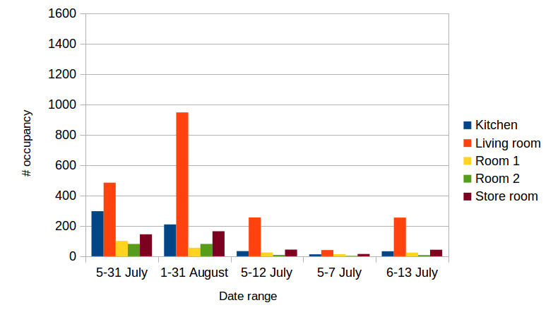
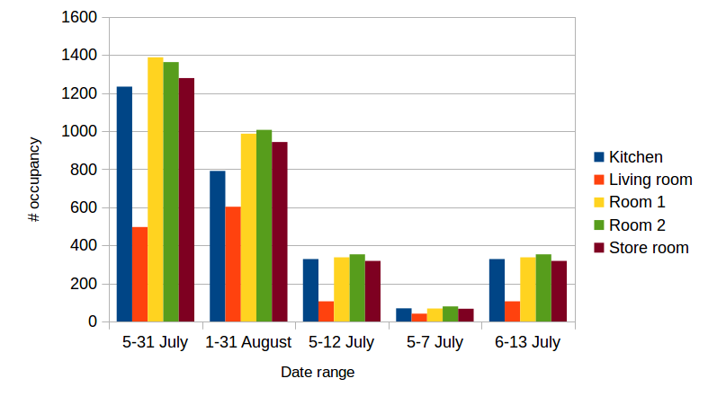
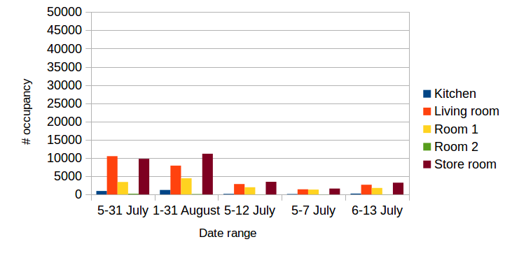
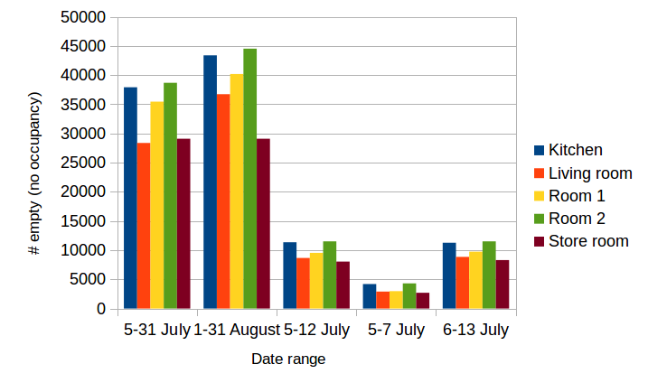
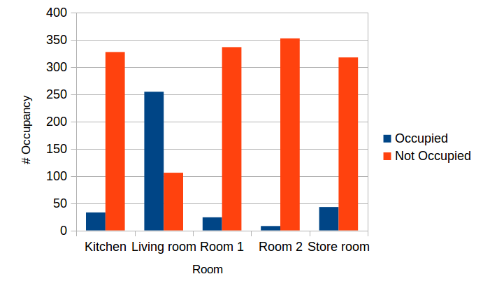
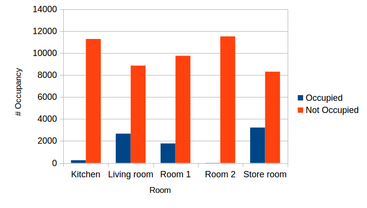
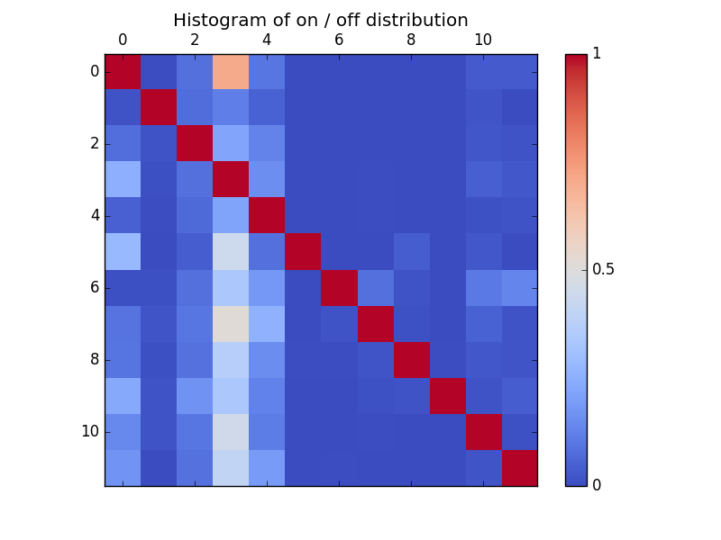

#Week 1
29 November 2016

## Room Occupancy Distribution
Distribution of both original (from DRED occupancy data) or manual (using threshold - i.e. room is occupied if non-background appliance is turned on) occupancy ground truth

### Multiple ranges
The graphs below show occupancy or non-occupancy data at different date ranges. No matter which date ranges are selected, class imbalance always happens (i.e. the number of positives and negatives are too different).

#### Original DRED Occupancy Ground Truth
 
    **Figure 1** *Distribution of Occupancy at Multiple Date Ranges Using Original Ground Truth*

 
    **Figure 2** *Distribution of No Occupancy (Empty) at Multiple Date Ranges Using Original Ground Truth*

#### Manual DRED Occupancy Ground Truth
 
    **Figure 3** *Distribution of Occupancy at Multiple Date Ranges Using Manually Generated Ground Truth*

 
    **Figure 4** *Distribution of No Occupancy (Empty) at Multiple Date Ranges Using Manually Generated Ground Truth*

### 6 July to 13 July 2016
The graphs below show both the number of occupancy (positives - room is occupied) and non-occupancy (negatives - room is not occupied). Most ground truths (original and manual) are negative.

#### Original DRED Occupancy Ground Truth
 
    **Figure 5** *6-13 July Room State based on Original Ground Truth*

#### Manual DRED Occupancy Ground Truth
 
    **Figure 6** *6-13 July Room State based on Manually Generated Ground Truth*

##Histogram
Below is the histogram which shows the relation between the appliances:

 
    **Figure 1** *The probability of appliances in x axis to be ON when appliance in y axis is turned on*

The appliances are: *television, fan,fridge, laptop computer, electric heating element, oven, unknown, washing machine, microwave, toaster, sockets, and cooker* consecutively. As seen from the Figure 1, there is no appliance which was used at the same time.

Below is the data:

|                          | television   | fan          | fridge       | laptop computer | electric heating element | oven         | unknown              | washing machine | microwave    | toaster      | sockets      | cooker       |
|--------------------------|--------------|--------------|--------------|-----------------|--------------------------|--------------|----------------------|-----------------|--------------|--------------|--------------|--------------|
| television               | 1            | 0.0045281533 | 0.0839348996 | 0.7062606641    | 0.1017193857             | 0.0013125082 | 6.56254101588135E-05 | 0.0035437721    | 0.0024937656 | 0.0024937656 | 0.0391127445 | 0.036159601  |
| fan                      | 0.0183803942 | 1            | 0.0756526372 | 0.120671284     | 0.0530101225             | 0            | 0.0002663825         | 0.0031965903    | 0.0010655301 | 0.0007991476 | 0.020777837  | 0.0031965903 |
| fridge                   | 0.0792244797 | 0.0175916749 | 1            | 0.2220639247    | 0.1316278494             | 0.0001858276 | 0.0006194252         | 0.003592666     | 0.0021679881 | 0.0017343905 | 0.0261397423 | 0.0170961348 |
| laptop computer          | 0.2529021949 | 0.0106452977 | 0.0842458993 | 1               | 0.1590684777             | 0.0007284862 | 0.0009399821         | 0.0069793674    | 0.0034074353 | 0.0012924754 | 0.0443201579 | 0.0303379236 |
| electric heating element | 0.0493237868 | 0.0063325378 | 0.0676213206 | 0.2154017502    | 1                        | 0.0001909308 | 0.0007000796         | 0.0048050915    | 0.0019411297 | 0.0006682578 | 0.0155608592 | 0.0195704057 |
| oven                     | 0.2857142857 | 0            | 0.0428571429 | 0.4428571429    | 0.0857142857             | 1            | 0                    | 0               | 0.0428571429 | 0            | 0.0285714286 | 0            |
| unknown                  | 0.0084033613 | 0.0084033613 | 0.0840336134 | 0.3361344538    | 0.1848739496             | 0            | 1                    | 0.0840336134    | 0.0168067227 | 0            | 0.1092436975 | 0.1344537815 |
| washing machine          | 0.0935875217 | 0.020797227  | 0.1005199307 | 0.5147313692    | 0.2616984402             | 0            | 0.0173310225         | 1               | 0.0155979203 | 0.0034662045 | 0.0519930676 | 0.0190641248 |
| microwave                | 0.0969387755 | 0.0102040816 | 0.0892857143 | 0.3698979592    | 0.1556122449             | 0.0076530612 | 0.0051020408         | 0.0229591837    | 1            | 0.0076530612 | 0.0280612245 | 0.0229591837 |
| toaster                  | 0.2331288344 | 0.018404908  | 0.1717791411 | 0.3374233129    | 0.1288343558             | 0            | 0                    | 0.0122699387    | 0.018404908  | 1            | 0.018404908  | 0.0429447853 |
| sockets                  | 0.1430285577 | 0.0187185025 | 0.1012718982 | 0.4526037917    | 0.117350612              | 0.0004799616 | 0.0031197504         | 0.007199424     | 0.0026397888 | 0.0007199424 | 1            | 0.0155987521 |
| cooker                   | 0.1744222855 | 0.0037986705 | 0.0873694207 | 0.4086736309    | 0.1946818613             | 0            | 0.005064894          | 0.0034821146    | 0.0028490028 | 0.0022158911 | 0.0205761317 | 1            |
