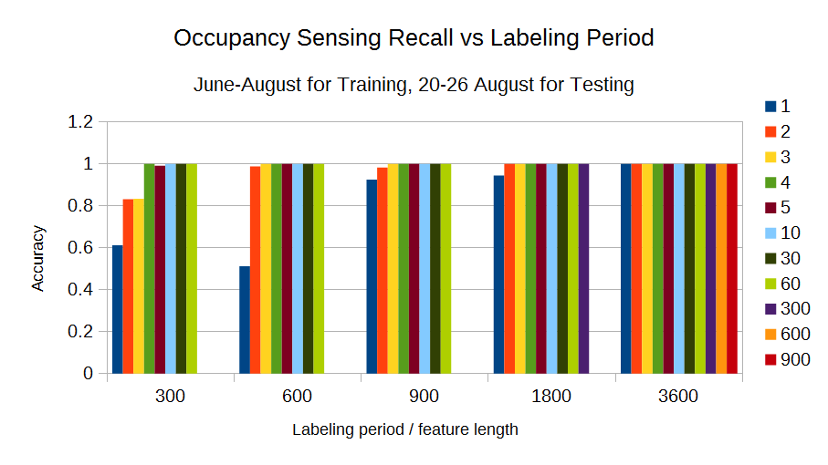
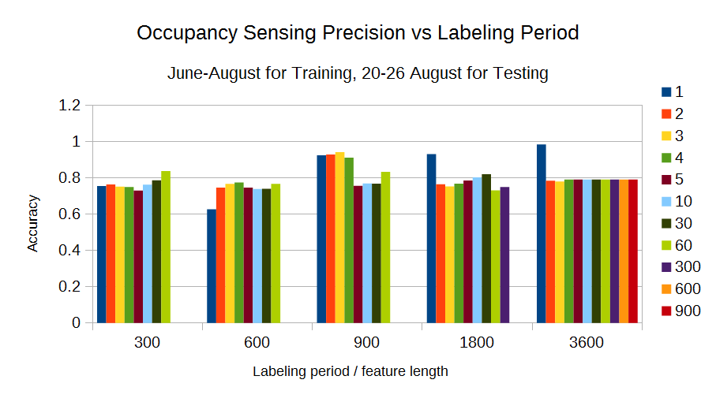
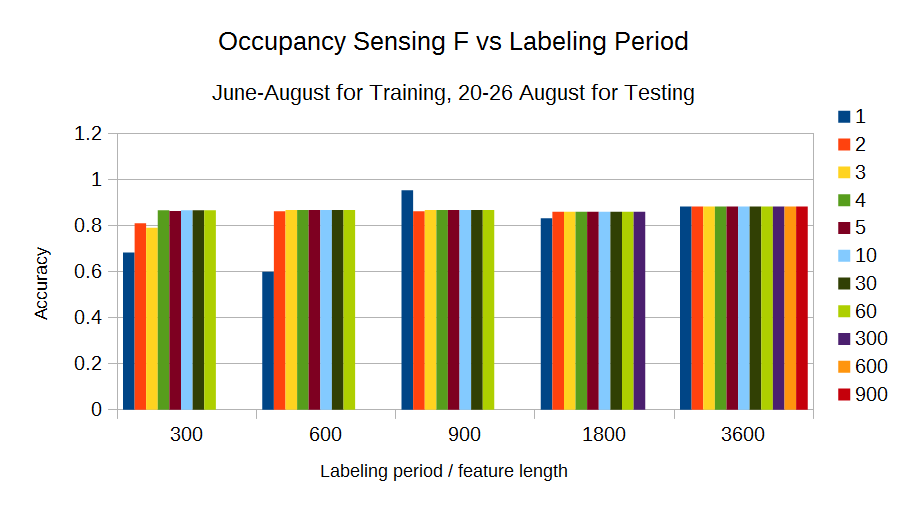
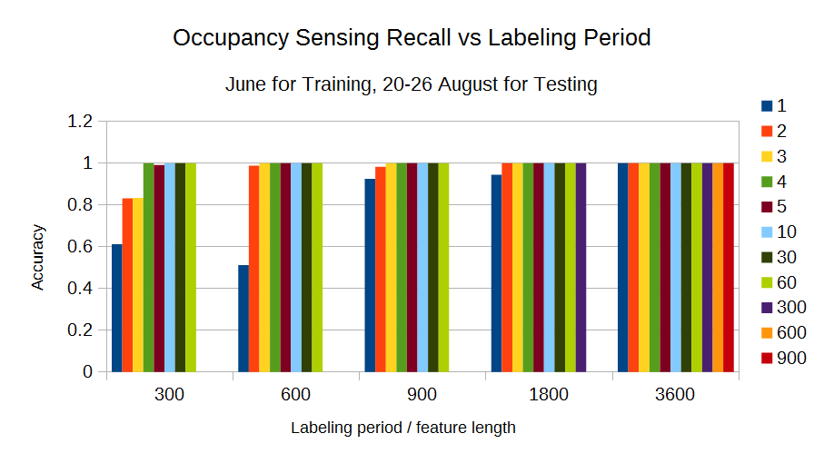
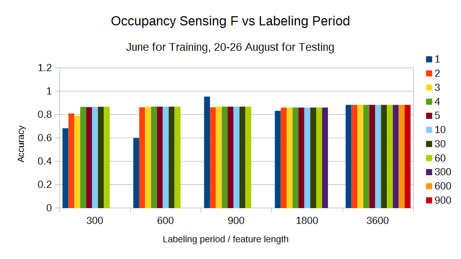
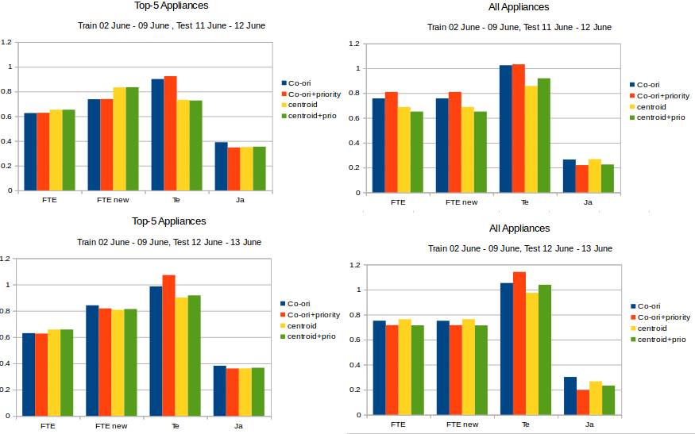
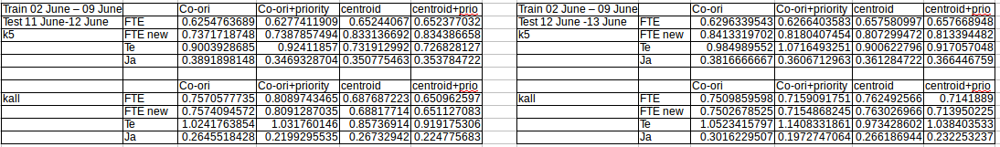

# Week 10
*20 September 2016*

## PCA-SVM Occupancy Sensing
### Sensing accuracy

UPDATE 15/9. Calculate tp, fp, tn, fn on the 3 month training and 1 week testing scenario. We also do 3 month training and 1 day testing scenario:

#### 1 Week Testing

 
    **Figure 1** *Precision with 3 month training*

 
    **Figure 2** *Recall with 3 month training*

 
    **Figure 3** *F values with 3 month training*

#### 1 Day (20th August) Testing
	
 
    **Figure 4** *Precision with 1 day testing*

 
    **Figure 5** *Recall with 1 day testing*

 
    **Figure 6** *F values with 1 day testing*
	
## Integration

 
    **Figure 7** *ROSES integration diagram*

## NILMTK
### Training 1 week and Test 1 day
 
    **Figure 8** *Top-5 Appliances and All Appliances*
    
 
    **Figure 9** *The Result of Top-5 Appliances and All Appliances*
