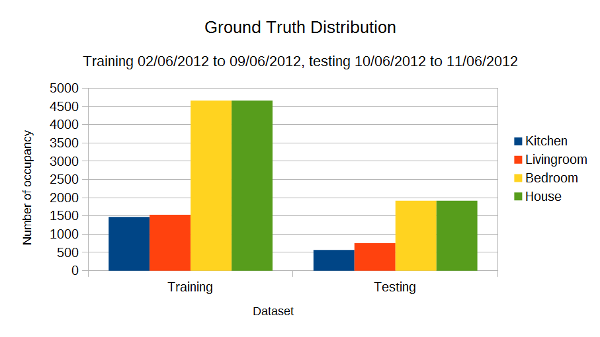
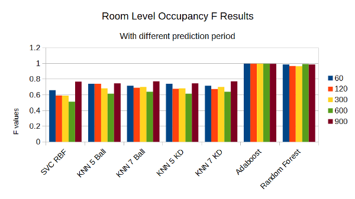
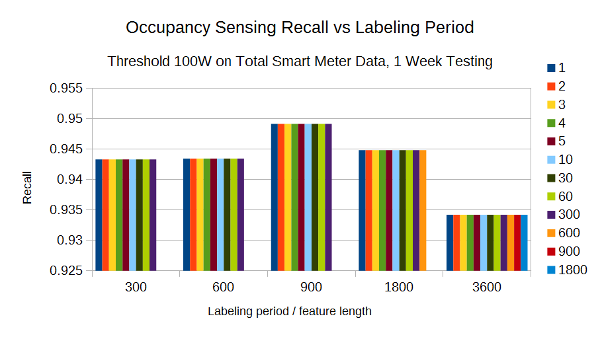
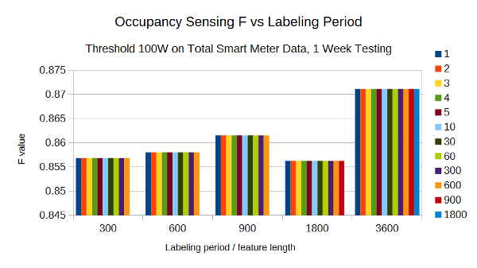

# Week 11
*29 September 2016*

## ROSeS - Room Occupancy Sensing based on Smart Meter data
#### 1 Week Training, 1 Day Testing

 
    **Figure 1** *Distribution 1W 2D*

 
    **Figure 2** *Precision 1W 2D*

 
    **Figure 3** *Recall 1W 2D*

 
    **Figure 4** *F 1W 2D*

## Occupancy Sensing based on Threshold
The accuracy depends on the threshold.

 
    **Figure 5** *Precision 1W*

 
    **Figure 6** *Recall 1W*

 
    **Figure 7** *F 1W*