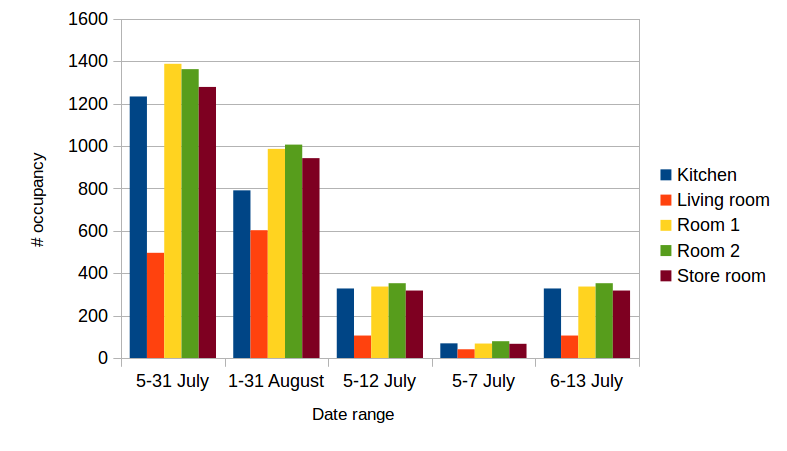
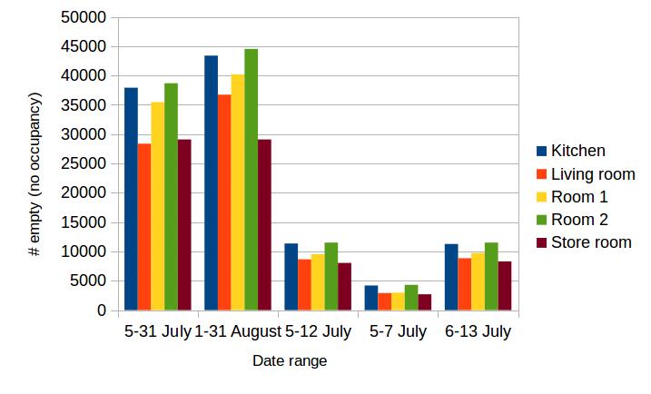

# Week 13
*3 December 2016*

## Room Occupancy Distribution
Distribution of both original (from DRED occupancy data) or manual (using threshold - i.e. room is occupied if non-background appliance is turned on) occupancy ground truth

### Multiple ranges
The graphs below show occupancy or non-occupancy data at different date ranges. No matter which date ranges are selected, class imbalance always happens (i.e. the number of positives and negatives are too different).

#### Original DRED Occupancy Ground Truth
 
    **Figure 1** *Distribution of Occupancy at Multiple Date Ranges Using Original Ground Truth*

 
    **Figure 2** *Distribution of No Occupancy (Empty) at Multiple Date Ranges Using Original Ground Truth*

#### Manual DRED Occupancy Ground Truth
 
    **Figure 3** *Distribution of Occupancy at Multiple Date Ranges Using Manually Generated Ground Truth*

 
    **Figure 4** *Distribution of No Occupancy (Empty) at Multiple Date Ranges Using Manually Generated Ground Truth*

### 6 July to 13 July 2016
The graphs below show both the number of occupancy (positives - room is occupied) and non-occupancy (negatives - room is not occupied). Most ground truths (original and manual) are negative.

#### Original DRED Occupancy Ground Truth
 
    **Figure 5** *6-13 July Room State based on Original Ground Truth*

#### Manual DRED Occupancy Ground Truth
 
    **Figure 6** *6-13 July Room State based on Manually Generated Ground Truth*
