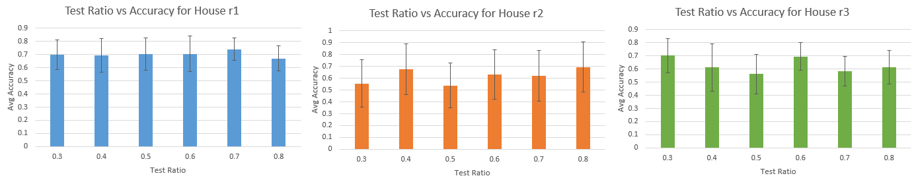
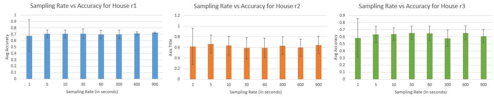
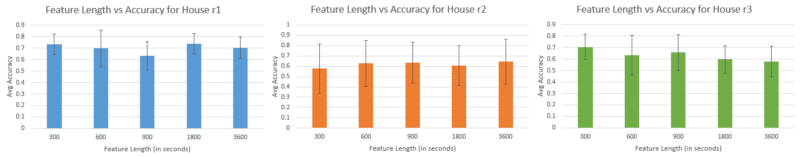

# Week 4
*5th August 2016*

## PCA-SVM Occupancy Monitoring
Based on Monday (1/8) meeting, occupancy sensing module should be configurable in terms of:
* Ratio of testing and training data
* Sampling rate. Originally, data is obtained every 1 second. Because we want to limit access (i.e. protect privacy), sampling rate should be configurable to find a safe yet still accurate prediction.
* Feature length. Since sampling rate is configurable, to ensure that feature length is divisible by the resampled data, feature length should also be configurable. Originally, this is set to 15 minutes (900 data point).

The diagram of implementation is shown in figure 1 below.


    **Figure 1** *Configurable PCA-SVM implementation diagram*
    
The boxes denote processes or functions, the circles denote data (dataframe, numpy array, or single value). This is similar to diagram in week 3, except that now there are:
* Resampler before feature extractor.
* Three inputs: test ratio, sampling rate, and feature length.

**Running**

```py
$ python pca-svm-cv-conf.py --house=<house_id> --tr=<test_ratio> --sr=<sampling_rate> --fl=<feature length>
```

Notes:
* house_id can be r1, r2, or r3.
* test_ratio is decimal number, 0.0 < test_ratio < 1.0. ratio of training data is 1 - test_ratio.
* sampling_rate measured in second.
* feature_length measured in second. Feature length should be at least twice the sampling_rate.

Using Python(x,y)-2.7.10.0 in Windows 8 x64 OS. Machine is i7, 16GB RAM, 512 GB SSD. 

The result will be available in 1-5 minutes depending on the size of the dataset.

**Result**

The result is obtained using a script (runner.py) that runs pca-svm-cv-conf.py over all houses, test ratios, sampling rates, and feature lengths. It is plotted on the following diagrams (each diagram represents a house).


    **Figure 2** *Varying the test ratio*	

Varying the the size of test set on all houses does not show a linear relation between size of test set and accuracy. Some size gives a result that resembles a random guess (only a little bit higher than 50%). However, we can see that 0.6 and 0.8 test set ratio gives a pretty good prediction result for all houses in general.
	

    **Figure 3** *Varying the sampling rate*	

Based on figure 3 above, decreasing the sampling rate surprisingly improves the occupation sensing accuracy, at least compared to the original 1 Hz sampling rate. Decreasing the sampling rate even further does not necessarily reduce nor improves the accuracy for all houses in general. For example, increasing the sampling period to 5 minutes (300 seconds) gives a high accuracy prediction for house r2, but it gives a low accuracy prediction for house r3.
	

    **Figure 4** *Varying the feature length*
	
Finally, in terms of feature length, the 15 minutes window that is used by the original paper [[1](#household)] gives the best result for all houses. Furthermore, using 10 minutes or 30 minutes feature length also still gives a good result.

In conclusion, decreasing the sampling rate does not necessarily drops the occupancy sensing accuracy. Furthermore, readjusting the feature length shorter to 10 minutes or longer to 30 minutes are also possible as it does not reduce the accuracy. Finally, to get a good result, the size of test set should be larger than the training set (4:3 or 4:1).

### References
1. <div id="household"/> Kleiminger, W., Beckel, C., & Santini, S. (2015). Household Occupancy Monitoring Using Electricity Meters. ETH Zurich.