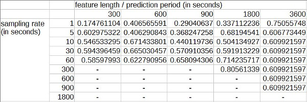
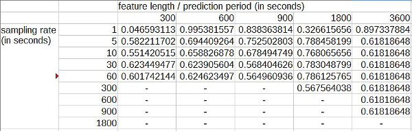

# Week 7
*3 September 2016*

## PCA-SVM Occupancy Sensing
### Extra information
Based on Monday (1/8) meeting, occupancy sensing module should be able to predict:
* Room level occupancy
* Minimum number of occupants in the house

Using the output of house level occupancy prediction and the output of NILMTK algorithm, room level occupancy prediction and minimum number of occupant in the house is predicted. The step of room level occupancy detection is seen as figure bellow:

 
    **Figure 1** *Expanded occupancy sensing*

The rules library consists of if - then rules that detects the existance of user based on the disaggregated appliance data: The appliance that produces high energy demand indicates the user activity in the place where the appliance is located.

Using Orange data mining library, we can obtain association rules. For example, given a set of appliances, we can have a certain confidence that a certain appliance is also used together.

Rules shown in figure 2 below is derived from a basket file that is based on house r2 ground truth data (plugs data) in the ECO dataset (support 0.2, confidence 0.6):

    **Figure 2** *Basket rules of active appliances*

We will also explore more rules such as which appliance is active before/after a set of active appliances.	

### Sensing accuracy
After some modification on how to compute features (e.g. operates directly on single dataframe) we can see that several testing scenarios produced a desired output, i.e. as sampling rate is reduced, accuracy drops. One thing to note is that the ETHZ paper used sampling rate 1 seconds and feature length/labeling period 900 seconds. See these test scenarios:
* Test ratio 0.4, feature length (in second) 300, 600, and 1800
* Test ratio 0.5, feature length (in second) 3600
* Test ratio 0.6, feature length (in second) 600, 900, and 3600
* Test ratio 0.7, feature length (in second) 1800 and 3600
* Test ratio 0.8, feature length (in second) 300, 600, 1800, and 3600

See the following charts for more detail:

    **Figure 3** *Accuracy vs labeling period with test ratio 0.4*

    **Figure 4** *Accuracy vs labeling period with test ratio 0.5*
	

    **Figure 5** *Accuracy vs labeling period with test ratio 0.6*
	

    **Figure 6** *Accuracy vs labeling period with test ratio 0.7*
	

    **Figure 7** *Accuracy vs labeling period with test ratio 0.8*

Tables below are provided to show even more detail:

	**Table 1** *Accuracy vs labeling period with test ratio 0.5*

    
	**Table 2** *Accuracy vs labeling period with test ratio 0.6*

	
	**Table 3** *Accuracy vs labeling period with test ratio 0.7*

    
