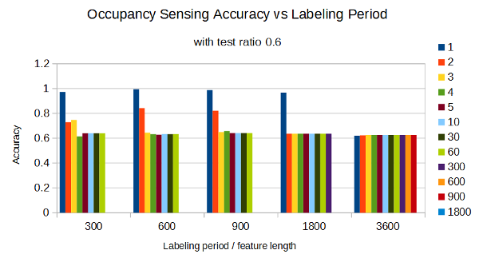
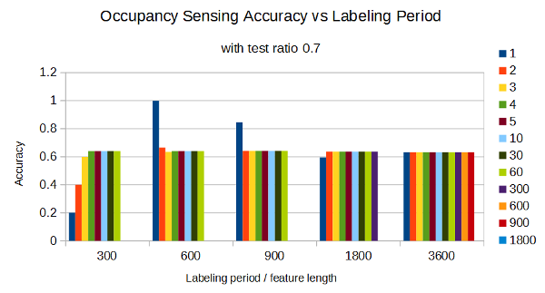
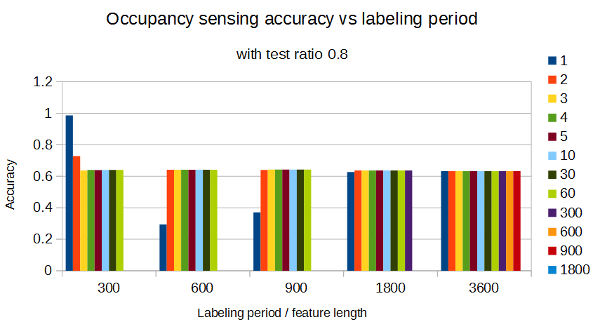
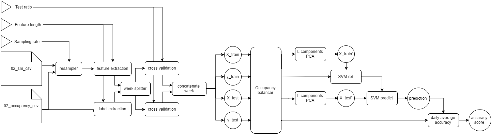

# Week 8
*9 September 2016*

## PCA-SVM Occupancy Sensing
### Sensing accuracy
Found some bugs in previous code and scenario:
* Code does not handle missing data (i.e -1 value is treated as power reading) but the dataset r2 still has missing data
* Computing pprob feature always give the same feature values because it has not take configurable sampling rate and feature length into consideration

After fixing them, these results are obtained (see figure 1-3 below):
	
 
    **Figure 1** *Accuracy vs labeling period with test ratio 0.6*
	
 
    **Figure 2** *Accuracy vs labeling period with test ratio 0.7*
	
 
    **Figure 3** *Accuracy vs labeling period with test ratio 0.8*

Test ratio 0.6 generates a desirable output, but not the case with 0.7 and 0.8. Furthermore, changing the dataset (e.g. adding/removing days) will lower the accuracy.

Several attempts to make it more robusts to bad dataset has been taken:
* Balance between occupied and unoccupied data in training
* Splitting dataset by cross validation can make training set to have an unbalanced mix between weekdays and weekends. I tried to balance between weekdays and weekends

The diagram of the module after these modifications are shown in figure 4 below:

 
    **Figure 4** *PCA SVM Configurable with Balancer*
	
Ultimately, these modifications does not improve the accuracy nor consistency, so it is still not used.