# Week 9
*13 September 2016*

## PCA-SVM Occupancy Sensing
### Sensing accuracy
Trying to improve accuracy graph by: 
1. [Use more training data than testing data (20:80 or 10:90 rule)](#twentyeighty) 
2. [Work only with weekdays data](#weekdays)  
3. [Work only with weekends data](#weekends) 
3. [Train with 1 month data, test on 1 week data](#onemonth) 

All results are obtained with 10 fold cross validation.

#### 20:80 OR 10:90 RULE 

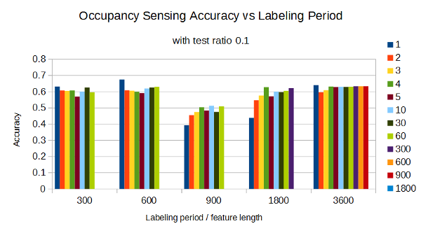 
    **Figure 1** *All week with 10% testing*

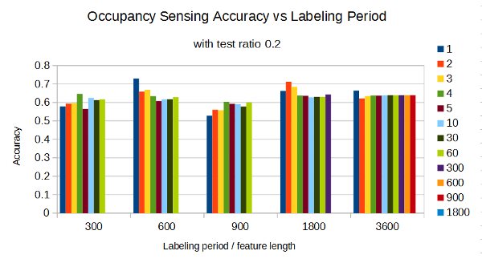 
    **Figure 2** *All week with 20% testing*

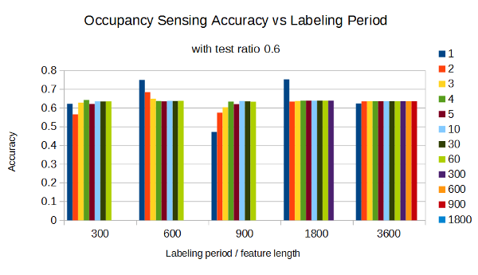 
    **Figure 3** *All week with 60% testing*	

#### WEEKDAYS DATA 
	
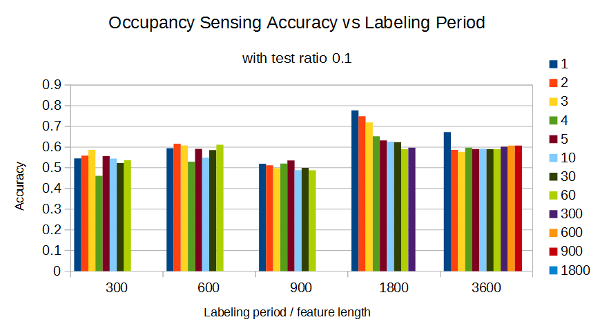 
    **Figure 4** *Weekdays with 10% testing*

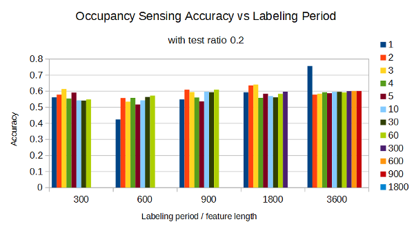 
    **Figure 5** *Weekdays with 20% testing*

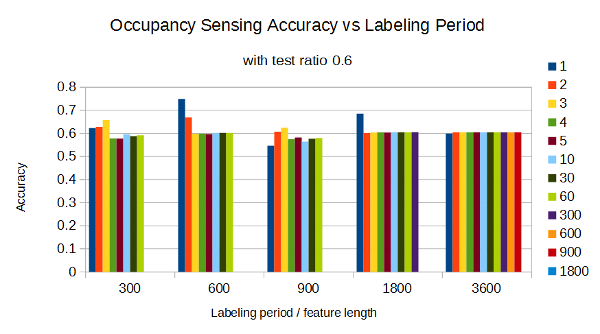 
    **Figure 6** *Weekdays with 60% testing*	

#### WEEKENDS DATA 
	
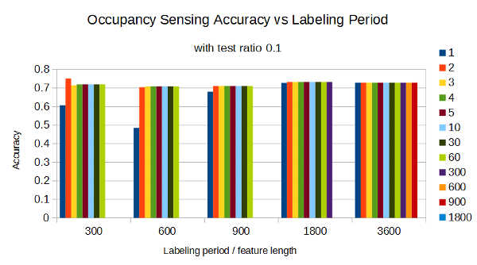 
    **Figure 7** *Weekends with 10% testing*

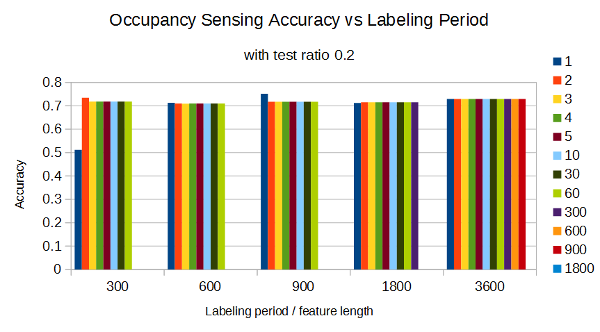 
    **Figure 8** *Weekends with 20% testing*

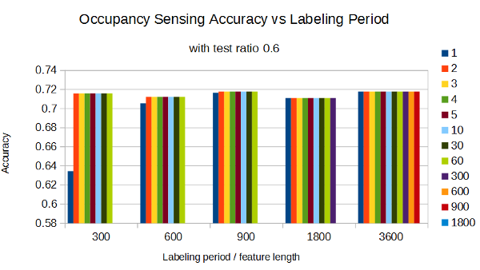 
    **Figure 9** *Weekends with 60% testing*	

#### TRAIN WITH 1 MONTH DATA, TEST ON 1 WEEK DATA 

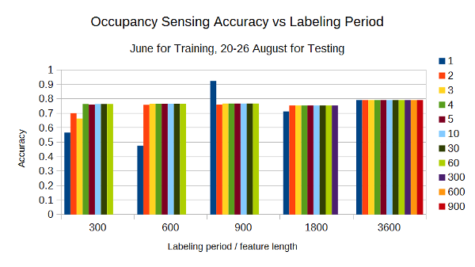 
    **Figure 10** *Train using June, test using a week in August*
	
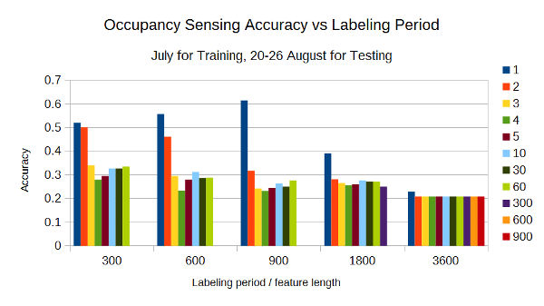 
    **Figure 11** *Train using July, test using a week in August*

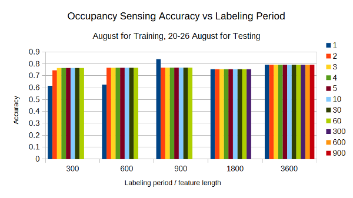 
    **Figure 12** *Train using some weeks in August, test using a week in August*
    
## NILMTK
Comparing the result metrics (FTE, Te, and Ja)  of Original CO, CO centroid, CO Centrod + Priority between All Appliances and Top-5 Appliances
### Summary
1.There is a significant improvement  for Top 5 FTE, using a new FTE compared to original FTE
(Train :  10-11 June 2012, Test : 11-12 June 2012)
a. Original CO (56.16%) 
b.CO Centorid (27.7%)
c. CO Centroid + Priority (27.90%)
(Train :  10-11 June 2012, Test : 12-13 June 2012)
a. Original CO (98.2%) 
b.CO Centorid (23.68%)
c. CO Centroid + Priority (22.77%)

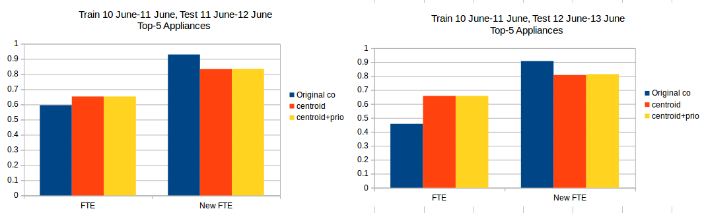 
    **Figure 13** *Comparing the new FTE and the original FTE*

 
2. The result from Top 5 Appliances are better than All Appliances
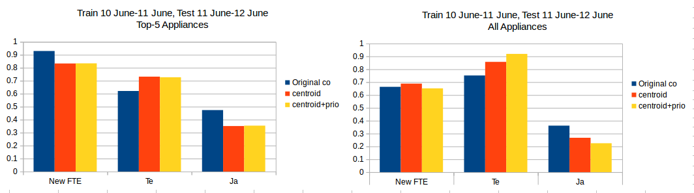 
    **Figure 14** *Comparing the Top 5 Appliances vs All Appliances* 

